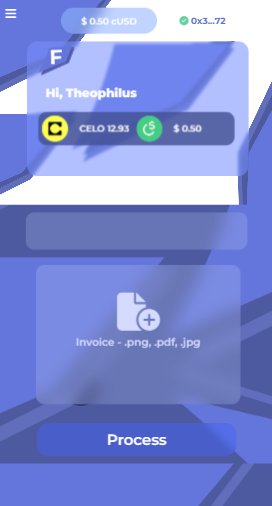

 <sup style="background-color:red; padding:2px; font-weight:600;">v1.0.0</sup>

# Fast Way 
<sub style="font-size:12px; font-weight:400;"> by Theophilus Owiti</sub>

<b>Work faster . Deliver Better</b>

<div style="display:flex; flex-direction:row;">
     
</div>

This project works on creating awesome experiences in invoicing of services, with less restriction implemented via CELO to allow anybody any where to receive funds easily eradicating long bank invoice payments periods. You simply add your company to the chain and the customer will easily pay their invoice through a fast invoice process with using Azure AI Document Analysis OCR Service.
<br/>

## Technologies Used
<div style="display:flex; flex-direction:row;">
     
     
    
     
</div>


## Introduction
The average small-to-mid-sized company takes about 25 days to process a single invoice manually from receipt to payment. Because of this, the transaction cycle and process of paying an invoice can take weeks when it actually shouldn't take any longer than a day or two to complete. 
Most businesses rely on invoices that are sent to banks and can often be slow in processing and maybe rejected most of the time. This project aims at using CELO for faster, accurate and cross-border disbursement of funds between businesses using invoices.

## 1. Getting started
### 1.1 Requirements
* Install Cello Wallet Chrome Extension
* Install node LTS 18+
* Install Git
* Fund your CELO Wallet with Faucet tokens
### 1.2 Installation
* Create a new directory in a place of your choice e.g.
```
    cd desktop
```
```
    mkdir celo-fastway-project
```
```
    cd celo-fastway-project
```
* Initialize a new node project
```
    npm init -y
```
* Install all the required modules
```
    npm install
```
